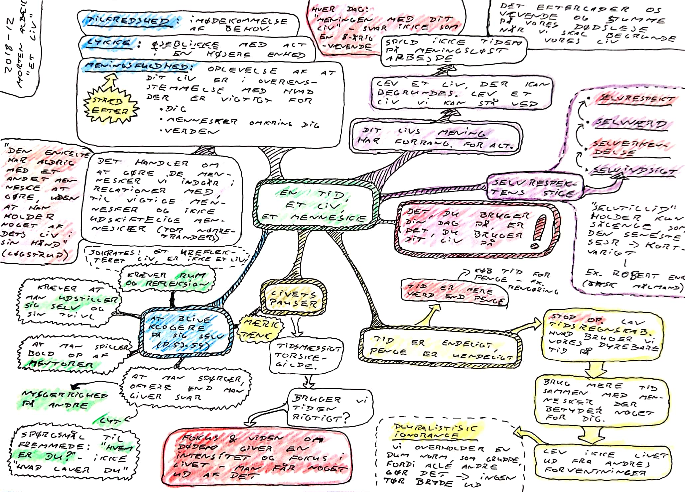

### ÉT LIV, ÉN TID, ÉT MENNESKE

**Morten Albæk** [*ÉT LIV, ÉN TID, ÉT MENNESKE*](https://www.gyldendal.dk/produkter/morten-alb%c3%a6k/%c3%a9t-liv-%c3%a9n-tid-%c3%a9t-menneske-47510/h%c3%a6ftet-9788702260069)

Om meningsfuldhed i livet, om at leve et liv der kan begrundes.

Om livets pauser, om at stoppe op og tænke.

*Et ureflekteret livt, er ikke et liv* - Sokrates

* [Albæks tale til ungdommen 2020](https://dansketaler.dk/tale/morten-albaeks-tale-til-ungdommen/)
