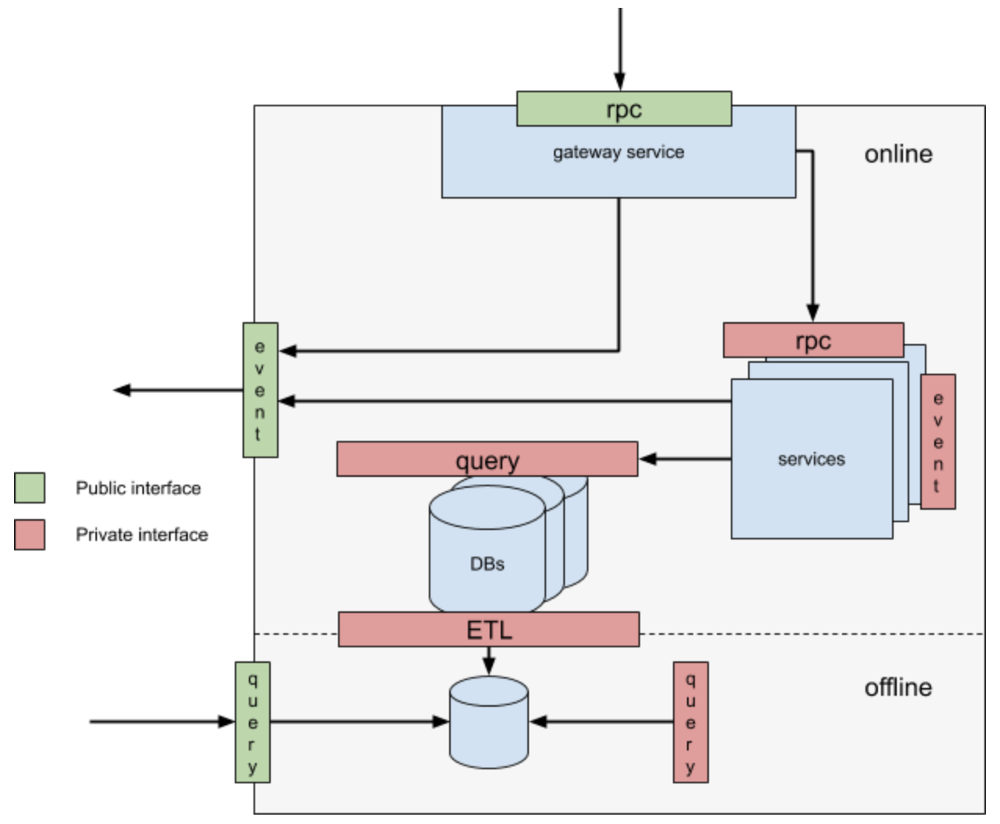

### Architectural Resources

#### API Design

* **Joshua Bloch, 2006** [How to design a good API and why it matters](./how-to-design-a-good-api.pdf)

#### Evolving a Microservice Architecture

*.. think of evolving a microservice architecture like “trimming a hedge” so that it eventually grows correctly, rather than a top-down or one-time architecture (or re-architecture) effort. It’s a dynamic and progressive process.* -- [Uber - blog post](https://www.uber.com/en-NL/blog/microservice-architecture/)

#### Domain-Oriented Microservice Architecture

* **Uber's blog post** [Introducing Domain-Oriented Microservice Architecture](https://www.uber.com/en-NL/blog/microservice-architecture/)
  * grouping of microservices into ***domains***, which is a logical grouping of functionality. The example given in the blog post is the *map search* service which is one domain.
  * collections of ***domains*** into ***layers***. Each ***layer*** can only depend on ***layers*** below it. Uber has established 5 layers
    * *edge layer* - exposing external APIs
    * *presentation layer* - API for clients (e.g. for mobile and web)
    * *product layer*  - functionality for a specific line of the business - based on the names it sounds to be 'verbs' (i.e. services)
    * *business layer* - general functionality used by all product domains - based on the names it sounds to be 'nouns' (i.e. data containers)
    * *infrastructure layer* - storage and networking
  * each ***domain*** exposes a ***gateway*** with a clean interface. No microservices can be accessed directly.
  

#### Distributed Systems

* **Waldo, J., Wyant, G., Wollrath, A. & Kendall, S., 1994** [A Note on Distributed Computing](https://scholar.harvard.edu/files/waldo/files/waldo-94.pdf)
* **Saltzer, J.H., Reed, D.P. & Clark, D.D., 1981** [End-to-End Arguments in System Design](https://web.mit.edu/Saltzer/www/publications/endtoend/endtoend.pdf)
  * [End-to-end principle](https://en.wikipedia.org/wiki/End-to-end_principle)
