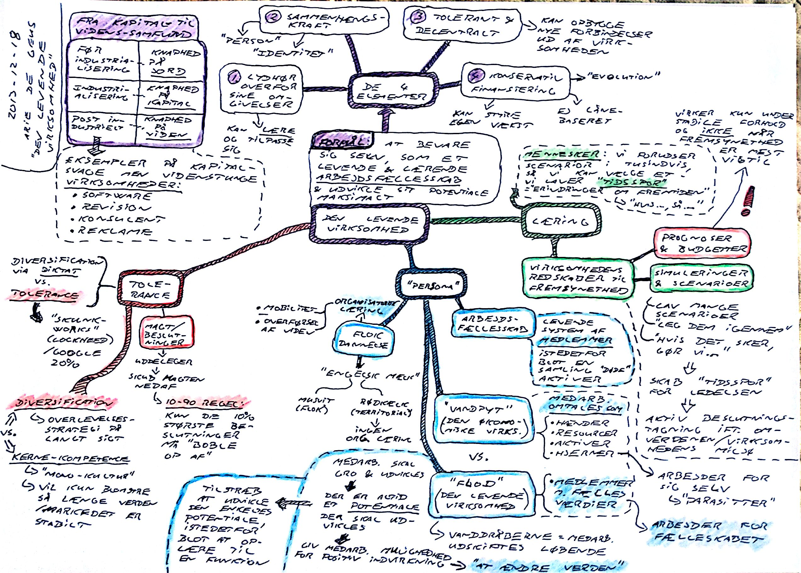

### The Living Company

**Arie de Geus** [*The Living Company*](https://www.amazon.co.uk/Living-Company-Learning-Longevity-Business/dp/1857881850/)

Om hvad der gør at en virksomhed kan overleve i århundreder. Den ses som en levende flod.

Om virksomheden som et *arbejdsfællesskab*, med et system af *medlemmer* med fælles værdier istedetfor blot en samling af *aktiver* (hænder, resourcer, etc.)

Om virksomhedens redskaber til fremsynethed:

* *prognoser og budgetter*: Virker kun under stabile forhold, og ikke når fremsynethed er vigtigst.
* *simuleringer og scenarioer*: Lav mange scenarioer og leg dem igennem - *"hvis det sker, gør vi .."*

Fra kapital til videnssamfund. Eksempler på kapital svage, men videnstunge virksomheder:

* software
* revision
* konsulent
* reklame

