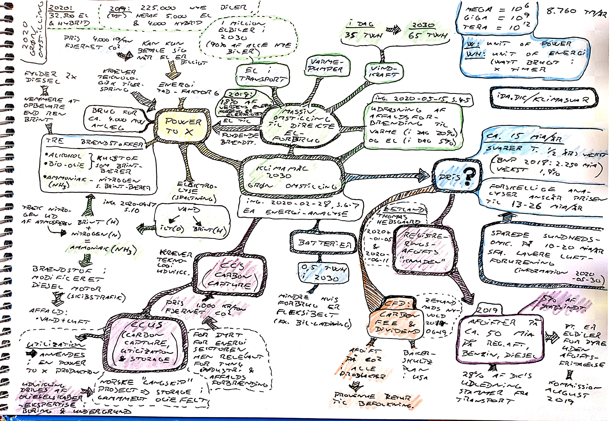
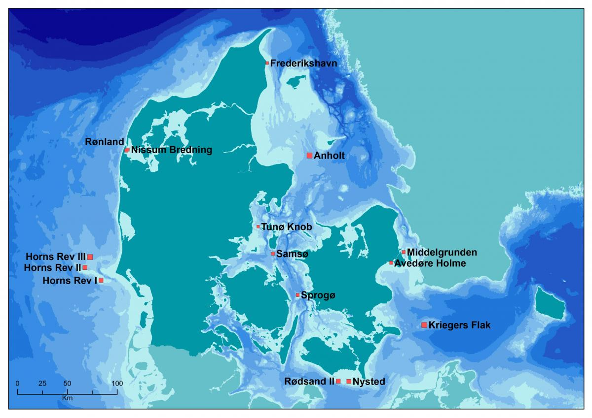
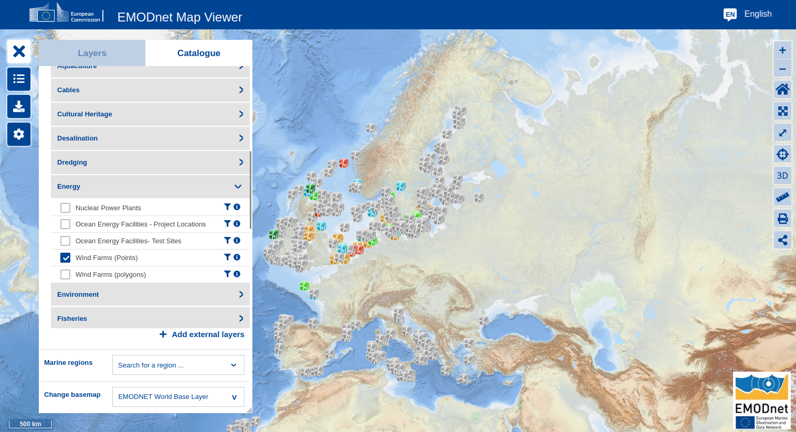
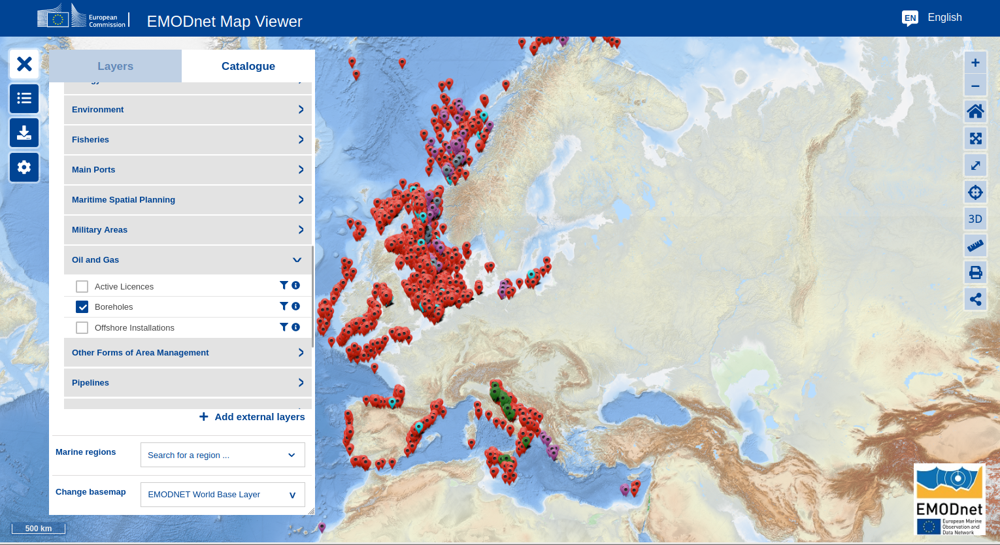
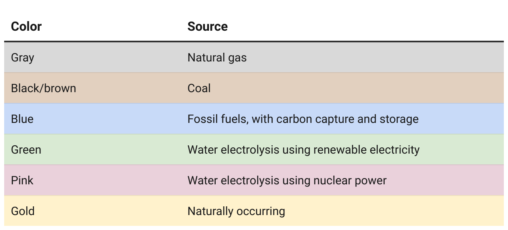
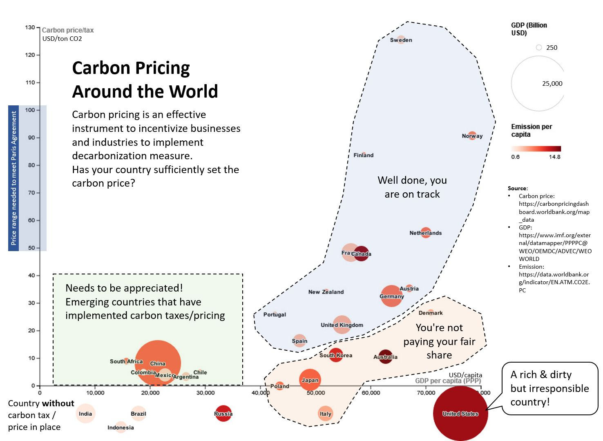

### Klimamål 2030 - Grøn Omstilling

En række noter baseret på artikler i Ingeniøren i løbet af 2020 om den grønne omstilling.

#### Vindmølle parker

[Danske havvind-mølle parker](https://ens.dk/ansvarsomraader/vindmoeller-paa-hav/ansoegte-og-etablerede-havvindmoelleparker)

* [Vattenfall's power plants](https://powerplants.vattenfall.com/)
* [Ørsted's renewable energy sites](https://orsted.com/en/what-we-do/renewable-energy-solutions)
* [WindEurope - European Offshore Wind Farms Map](https://windeurope.org/intelligence-platform/product/european-offshore-wind-farms-map-public/)

#### EMODnet [European Marine Observation and Data Network](https://emodnet.ec.europa.eu/en)

[Kort over marine aktiviter](https://emodnet.ec.europa.eu/geoviewer/#!/).

Se fx. antal havvind-mølle parker

I modsætning til antal bore huller

#### Batteri teknologi

MIT Technology Review (January 2023) - [What’s next for batteries](https://www.technologyreview.com/2023/01/04/1066141/whats-next-for-batteries/)

#### Brint / Hydrogen

MIT Technology Review (February 2023) - [When hydrogen will help climate change—and when it won't](https://www.technologyreview.com/2023/02/23/1069086/when-hydrogen-will-help-climate-change-and-when-it-wont/)

*The Hydrogen Rainbow* - hvor bæredygtig brint er afhænger af produktions formen. Man kan faktisk udvinde hydrogen direkte fra undergrunden ligesom olie - det ser faktisk ud som om det er en *renewable* resource da det skyldes en kemisk reaktion hvor vand i nogle områder reagerer med klipperne i undergrunden.

#### Carbon Pricing

Interessant LI post af [Danny Kusuma](https://www.linkedin.com/posts/danny-kusuma_carbonemissions-carbonpricing-renewableenergy-activity-7106096256334143488-HxZW) om carbon pris sammenholdt med GDP.

#### Resourcer

* Zetland's [5 minutters forklaring](https://youtu.be/BUn00A3vgSQ) om **Power-to-X**
* [DTU rapport om smarte energisystemer](https://features.dtu.dk/smarte-energisystemer/)
* [IDAs klimasvar](https://ida.dk/klimasvar)
* [Ea Energianalyse](https://www.ea-energianalyse.dk)
