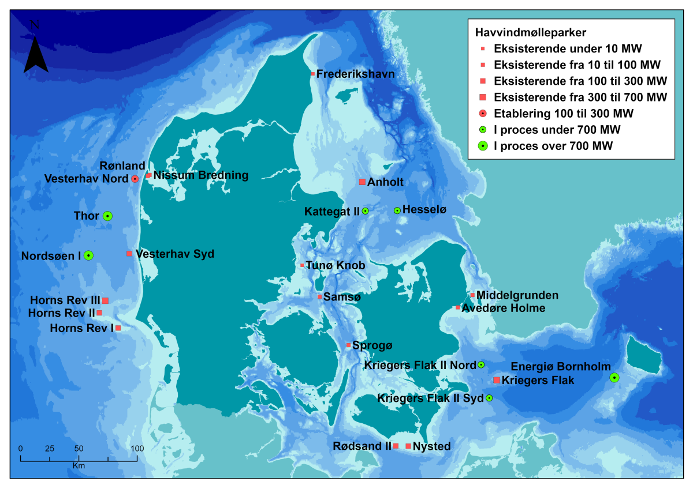
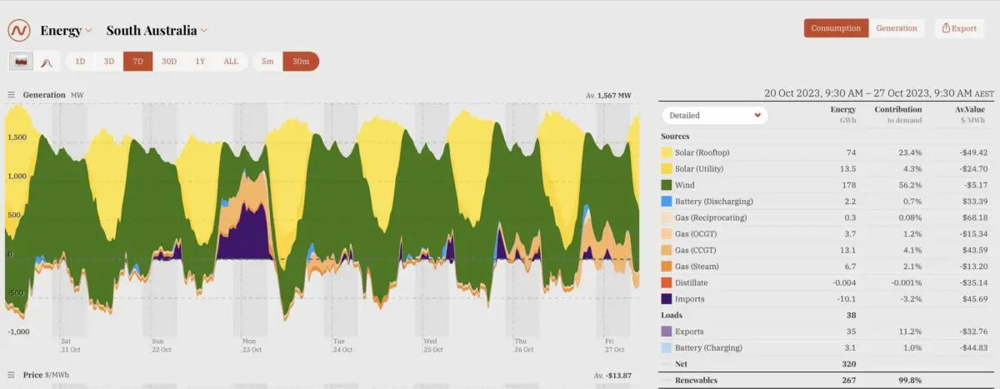

### 🌳 Grøn Omstilling

* [**Personligt Klimaaftryk**](./personal)

En række noter baseret på artikler i Ingeniøren i løbet af 2020 om den grønne omstilling om klimamålene 2030

***

#### ⚡ Vindmølle parker

[Danske havvind-mølle parker](https://ens.dk/energikilder/etablerede-havvindmoelleparker)

* [Vattenfall's power plants](https://powerplants.vattenfall.com/)
* [Ørsted's renewable energy sites](https://orsted.com/en/what-we-do/renewable-energy-solutions)
* [WindEurope - European Offshore Wind Farms Map](https://windeurope.org/intelligence-platform/product/european-offshore-wind-farms-map-public/)

***

#### 📜 Energi historier

##### 🇩🇰 Elektricificering i Danmark

Fra 2019 til 2024 er det danske el forbrug vokset med 3 TWh (≃9%). 1.88 TWh af disse skyldes vækst i elforbruget til fjernvarme, dvs. 615 af væksten i elforbruget skyldes vækst i store elpumper og øget udrulning af fjernvarme.

Kilde: Dansk fjernvarme - [Fjernvarmen driver elektrificeringen i Danmark](https://via.ritzau.dk/pressemeddelelse/14667069/fjernvarmen-driver-elektrificeringen-i-danmark?publisherId=3320505&lang=da)

***

##### 🇦🇺 South Australia

*[South Australia grid operates at 99.8 per cent wind and solar over past seven days](https://reneweconomy-com-au.cdn.ampproject.org/c/s/reneweconomy.com.au/south-australia-grid-operates-at-99-8-per-cent-wind-and-solar-over-past-seven-days/amp/)*

Hvordan South Australia har opbygget et elsystem hvor de over længere perioder kører med 100% grøn energi fra udelukkende vind og sol.

Australiens elsystem kan analyseres på [Open Electricity](https://openelectricity.org.au/)

***

##### 🇺🇾 Uruguay

*[Uruguay’s green power revolution: rapid shift to wind shows the world how it’s done](https://www.theguardian.com/global-development/2023/dec/27/uruguays-green-power-revolution-rapid-shift-to-wind-shows-the-world-how-its-done)*

Historien om hvordan Uruguay på 20 år er gået fra 0% grøn energi til idag at have et netværk hvor op imod 90-95% af deres strøm idag er grøn.

***

#### 🗺️ EMODnet [European Marine Observation and Data Network](https://emodnet.ec.europa.eu/en)

[Kort over marine aktiviter](https://emodnet.ec.europa.eu/geoviewer/#!/).

Se fx. antal havvind-mølle parker

I modsætning til antal bore huller

***

#### 🔋 Batteri teknologi

MIT Technology Review (January 2023) - [What’s next for batteries](https://www.technologyreview.com/2023/01/04/1066141/whats-next-for-batteries/)

***

#### 🌈 Brint / Hydrogen

MIT Technology Review (February 2023) - [When hydrogen will help climate change—and when it won't](https://www.technologyreview.com/2023/02/23/1069086/when-hydrogen-will-help-climate-change-and-when-it-wont/)

*The Hydrogen Rainbow* - hvor bæredygtig brint er afhænger af produktions formen. Man kan faktisk udvinde hydrogen direkte fra undergrunden ligesom olie - det ser faktisk ud som om det er en *renewable* resource da det skyldes en kemisk reaktion hvor vand i nogle områder reagerer med klipperne i undergrunden.

***

#### 💶 Carbon Pricing

Interessant LI post af [Danny Kusuma](https://www.linkedin.com/posts/danny-kusuma_carbonemissions-carbonpricing-renewableenergy-activity-7106096256334143488-HxZW) om carbon pris sammenholdt med GDP.

***

#### 📚 Resourcer

* Zetland's [5 minutters forklaring](https://youtu.be/BUn00A3vgSQ) om **Power-to-X**
* [Ea Energianalyse](https://www.ea-energianalyse.dk)
* Informations klimaleksikon [Information forklarer klimaet](https://www.information.dk/serie/information-forklarer-klimaet)
  * [Hvordan mindsker man mest effektivt sit aftryk på planeten? Forstå konsekvenserne af dit forbrug](https://www.information.dk/indland/2024/11/hvordan-mindsker-mest-effektivt-aftryk-paa-planeten-forstaa-konsekvenserne-dit-forbrug)
