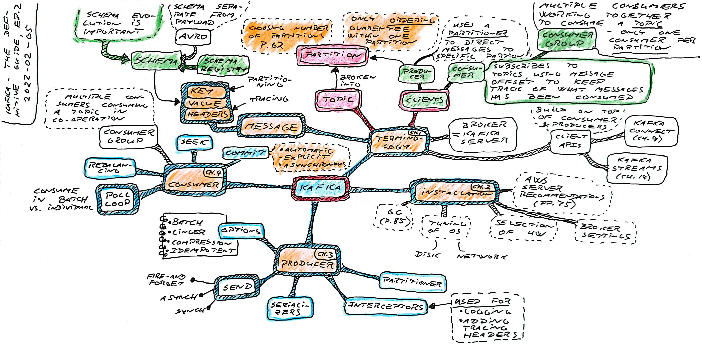
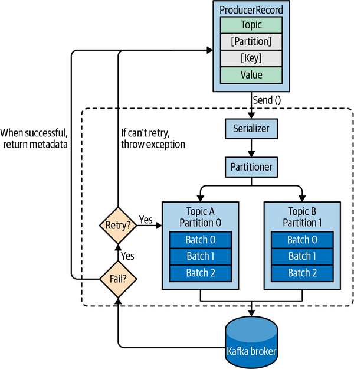
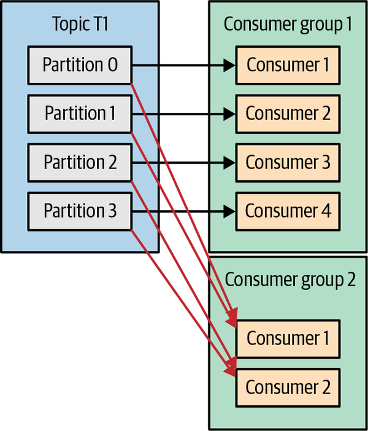

### Kafka - The Definitive Guide, ed. 2

[*Kafka: The Definitive Guide, Real-Time Data and Stream Processing at Scale*](https://www.confluent.io/resources/kafka-the-definitive-guide-v2/)

[](kafka-2022-02-05.jpg)

#### Chapter 1. **Meet Kafka** - Components and Terms

#### Chapter 2. **Installing Kafka**

**Scaling Kafka / Number of Partitions (p.62)**

```bash
# max processable messages per second equals number of partitions
# multiplied by messages processed per second in a consumer
total_number_messages_sec = partitions x number_messages_per_consumer_sec

# if the avg processing time per message is known,
# the number of messages per second on one consumer is
number_messages_per_consumer_sec = 1000 ms / processing_time_per_message_ms
```

**Example**

> If processing time per message is 20 ms -> number of messages per consumer = `50 msg/sec`
> If 500 messages is needed to be processed per second -> `10 partions x 50 msg/sec`

#### Chapter 3. **Kafka Producers** - Writing Messages to Kafka

High level producer overview (p.94)



#### Chapter 4. **Kafka Consumers** - Reading Data from Kafka

**Consumer groups**



If several applications subscribes to all the messages from the same *topic*, each application must have a *consumer group*.

Scaling of reading and processing of messages from the topics happen by adding consumers to an existing consumer group. Each additional consumer in a group will only get a subset of the messages.

Number of consumers can never exceed number of partitions (or the remainder will idle and consume no messages).
