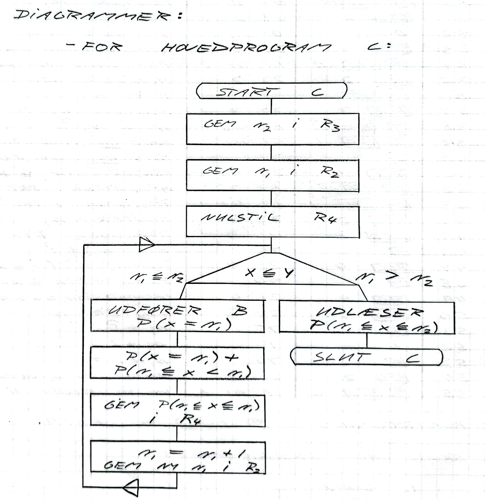
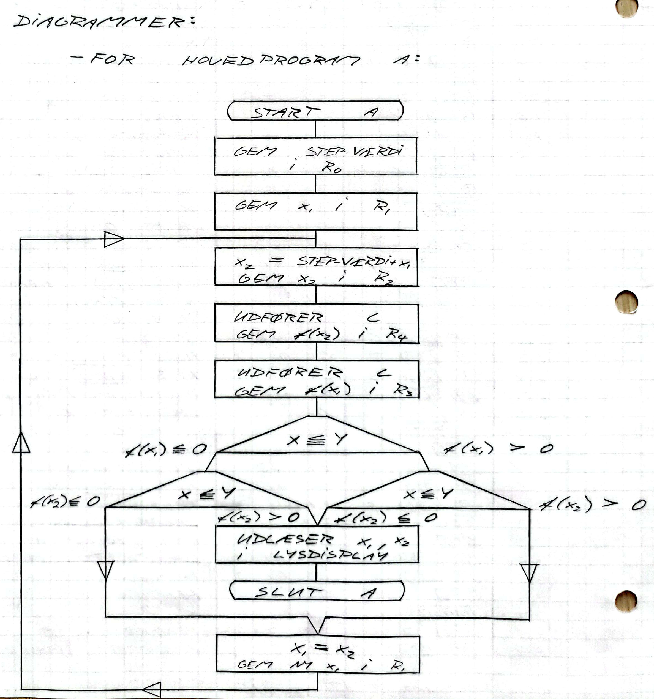

## Mathematics Notes

### HP-20S

I used a programmable Hewlett-Packard [HP-20S](https://en.wikipedia.org/wiki/HP-20S) scientific calculator in my high school math classes in the early 90's.

It is still fine and functional here 30 years later and most importantly it is [keystroke programmable](https://en.wikipedia.org/wiki/Keystroke_programming). A couple of programs I did back then are documented below.

These are my first programs - besides BASIC programming on Commodore 64 and Comal80 in public school on a [RC759 Piccoline](https://rc700.dk/) in the 80's.

#### Binomialfordelingen

Programs to calculate propabilities for [binomialfordelingen](https://da.wikipedia.org/wiki/Binomialfordelingen)

#### Bestemmelse af nulpunkter

Two programs to find roots (minima) in functions. One using [Newtons metode](https://da.wikipedia.org/wiki/Newtons_metode) and one using [bisektion](https://da.wikipedia.org/wiki/Bisektion)

