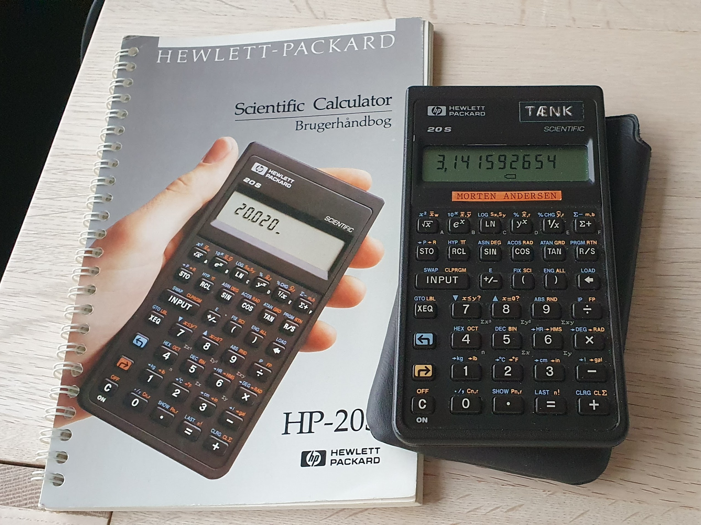

## Mathematics Notes

### HP-20S

I used a Hewlett-Packard [HP-20S](https://en.wikipedia.org/wiki/HP-20S) scientific calculator in my high school math classes.

It is still fine and functional here 30 years later

#### Binomialfordelingen

Programs to calculate propabilities for [binomialfordelingen](https://da.wikipedia.org/wiki/Binomialfordelingen)

#### Bestemmelse af nulpunkter

Programs to find roots (minima) in functions. Both using [Newtons metode](https://da.wikipedia.org/wiki/Newtons_metode) and [bisektion](https://da.wikipedia.org/wiki/Bisektion)

