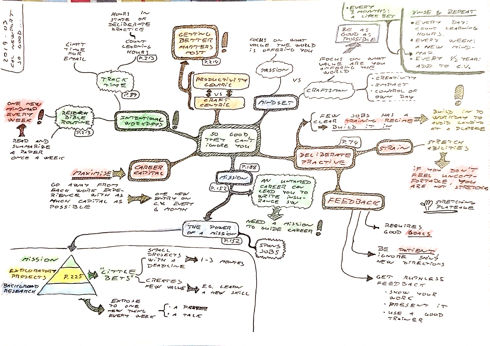
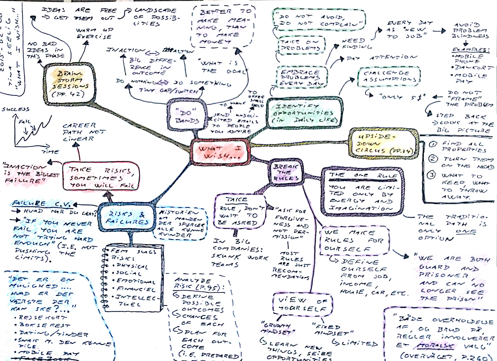
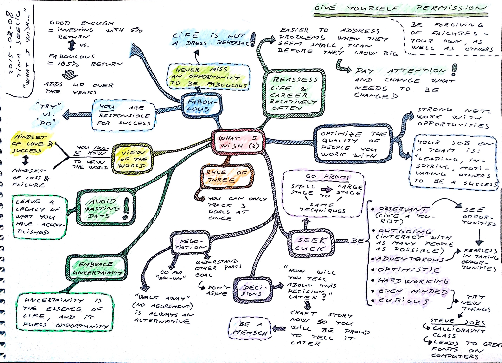
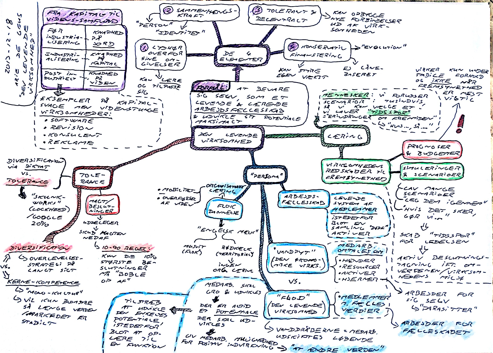
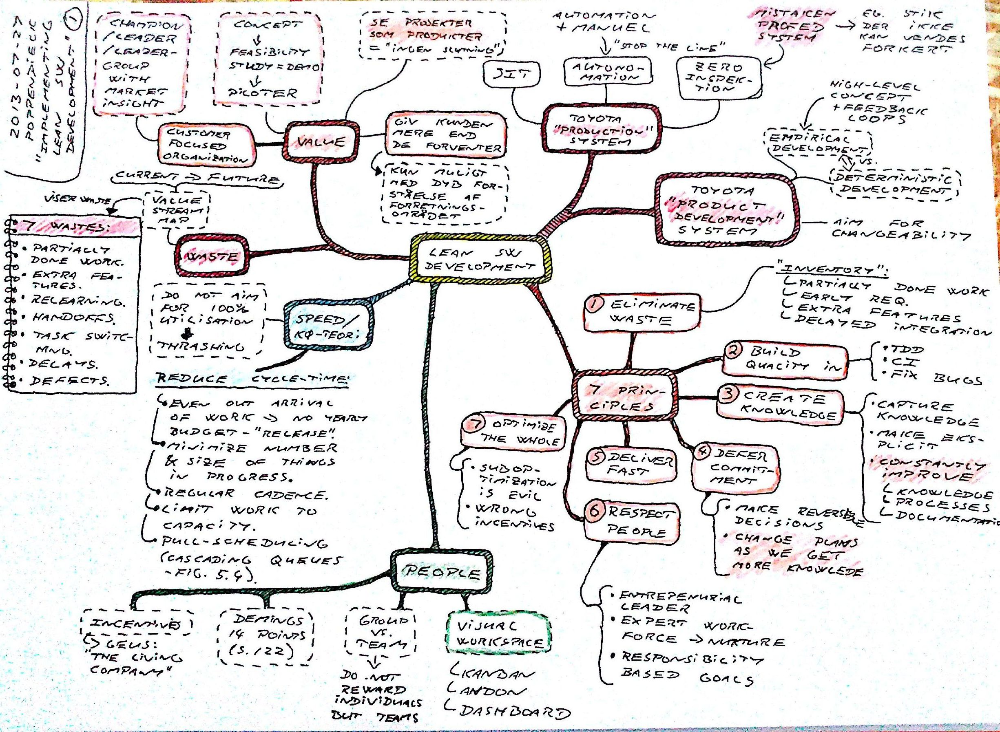
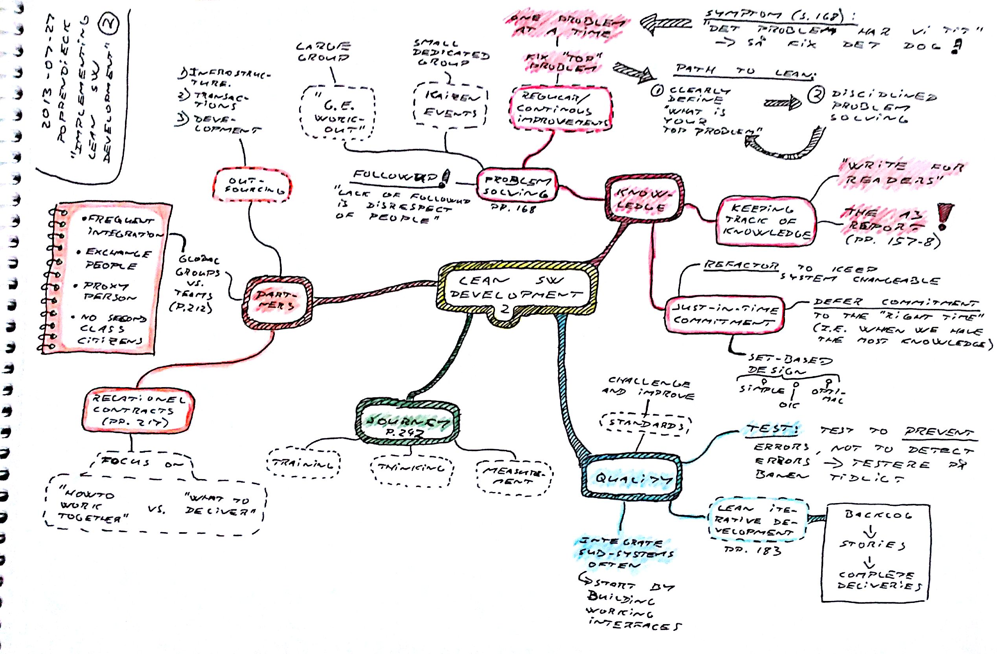
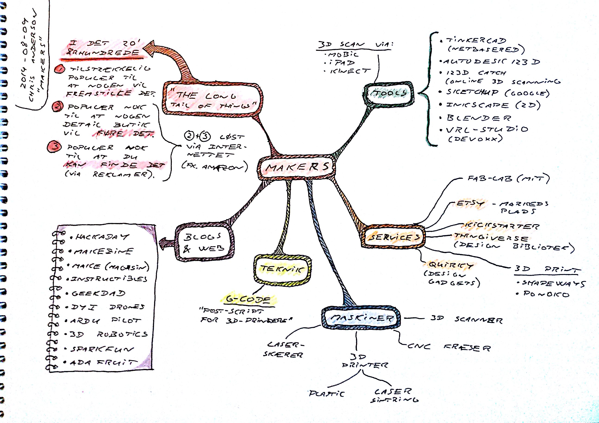
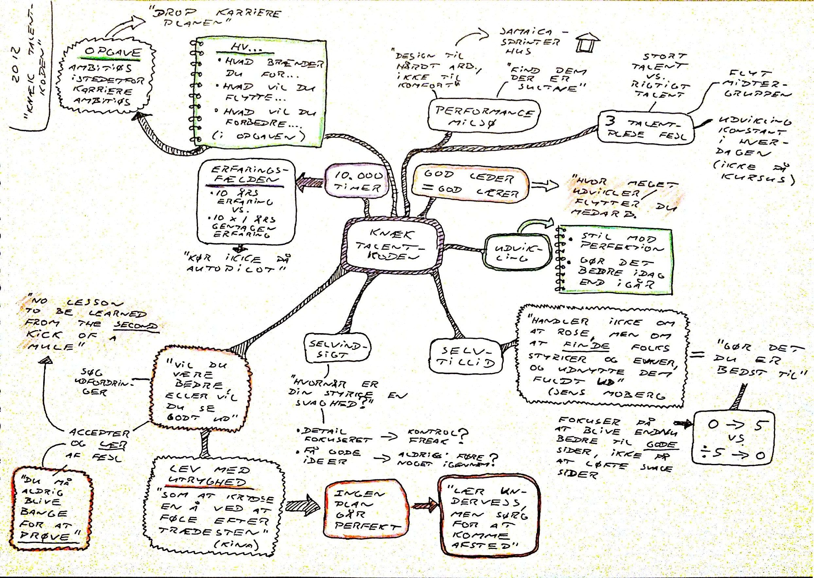
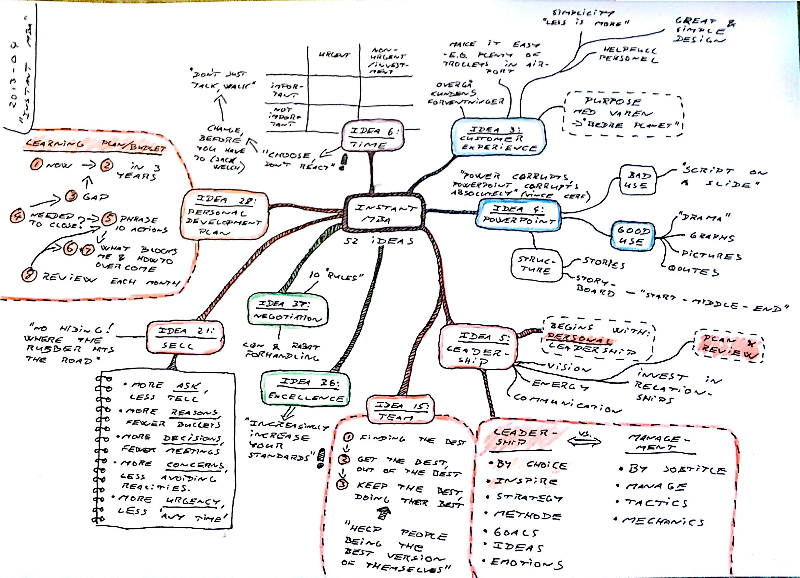

# Book Mindmaps

## ÉT LIV, ÉN TID, ÉT MENNESKE

Morten Albæk [ÉT LIV, ÉN TID, ÉT MENNESKE](https://www.gyldendal.dk/produkter/morten-alb%c3%a6k/%c3%a9t-liv-%c3%a9n-tid-%c3%a9t-menneske-47510/h%c3%a6ftet-9788702260069)

## So Good They Can't Ignore You

Cal Newport [So Good They Can't Ignore You](https://www.amazon.co.uk/gp/product/B01KFR64LQ/)

## What I Wish I Knew When I Was 20

Tina Seelig [What I Wish I Knew When I Was 20](https://www.amazon.co.uk/What-Wish-Knew-When-Was-ebook/dp/B07Q83G41J/)

## The Living Company

Arie de Geus [The Living Company](https://www.amazon.co.uk/Living-Company-Learning-Longevity-Business/dp/1857881850/)

## Implementing Lean Software Development

Mary & Tom Poppendieck [Implementing Lean Software Development](https://www.amazon.co.uk/Implementing-Lean-Software-Development-Addison-Wesley-ebook/dp/B00HNB3VQE)

## Makers: The new Industrial Revolution

Chris Anderson [Makers: The new Industrial Revolution](https://www.amazon.co.uk/Makers-Industrial-Revolution-Chris-Anderson-ebook/dp/B008K4JDLA/)

## Knæk Talentkoden

Rasmus Ankersen Knæk Talentkoden

## The 10 day MBA

Steven Silbiger [The 10-Day MBA](https://www.amazon.com/10-Day-MBA-step-step-18-Nov-2005/dp/B011T7K3L8)

## Instant MBA

Nicolas Bate [Instant MBA](https://www.amazon.co.uk/Instant-MBA-Business-Graduate-Brilliant-ebook/dp/B004INHHGA)

