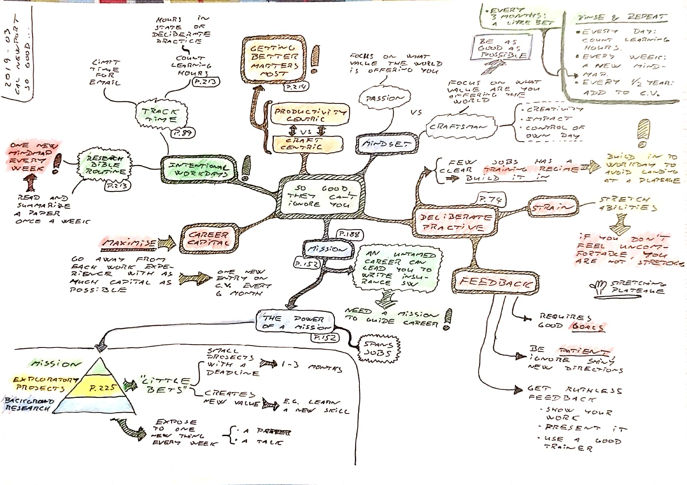

### So Good They Can't Ignore You

**Cal Newport** [*So Good They Can't Ignore You*](https://www.amazon.co.uk/gp/product/B01KFR64LQ/)

About the *craftsman* mindset vs. the *passion* mindset. Focus on *getting better*, not necessarily about being productive.

About *deliberate practice*, and maximizing the hours in state of deliberate practice.

About building *career capital* and *intentional workdays*.

About *background research*, being exposed to one new thing every week.

About *exploratory projects*, the *little bets*, i.e. small projects with a deadline.

