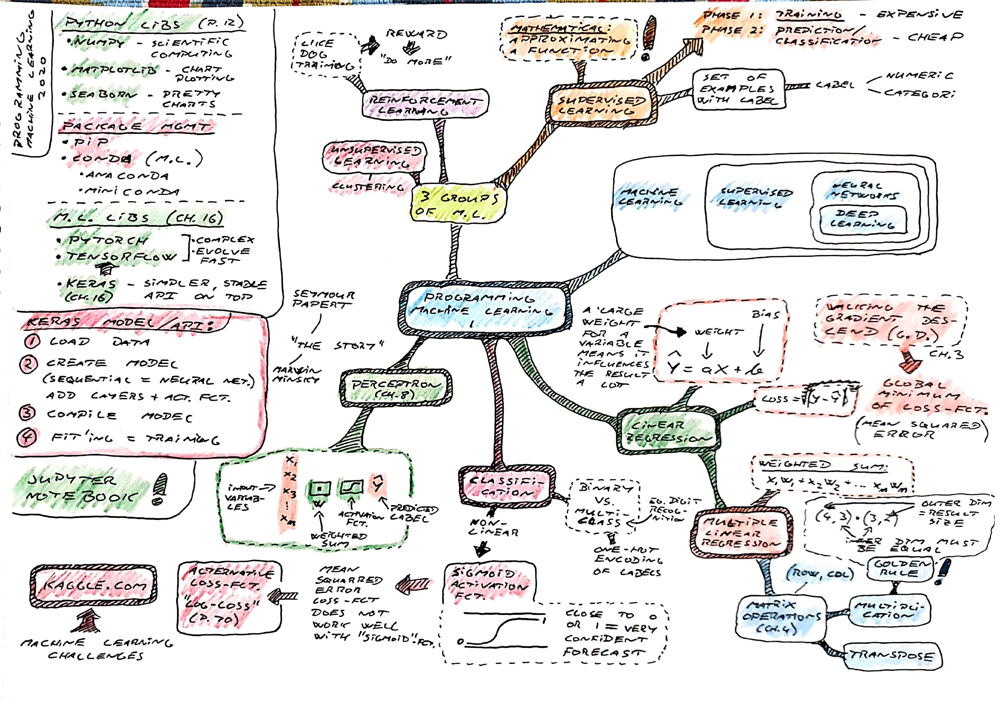
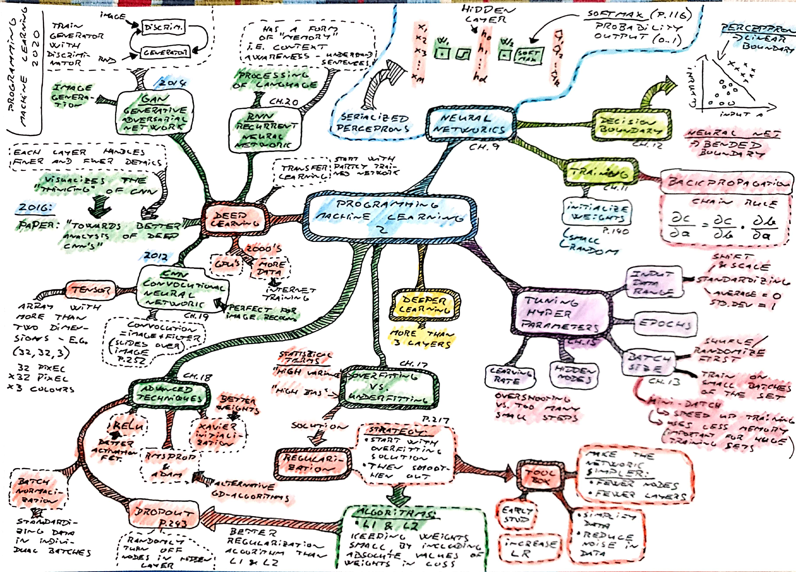

### Programming Machine Learning

**Paolo Perrotta** [*Programming Machine Learning*](https://pragprog.com/titles/pplearn/programming-machine-learning/)

Hands on introduction to machine learning with focus on *supervised learning* and the *deep learning* "explosion" after 2012

* **CNN - Convolutional Neural Network** (2012) - perfect for image *recognition*
* **GAN - Generative Adversarial Network** (2014)- for image *creation*
* **RNN - Recurrent Neural Network** - perfect for processing of language and sentences where "context" / "memory" is required




#### Software

* [Jupyter](https://jupyter.org/) - machine learning *notebooks* with a mix of text, live code, visualizations, etc.
* [Keras](https://keras.io/) simple API on top of Tensorflow
* [Tensorflow](https://www.tensorflow.org/) - machine learning library  developed by Google
* [PyTorch](https://pytorch.org/) - machine learning library  developed by Facebook

#### Setup using Miniconda

* install [Miniconda](https://docs.conda.io/en/latest/miniconda.html), a minimal Conda distribution
* create an environment `conda create --name=machinelearning python=3`
* install packages
```bash
conda install numpy=1.15.2
conda install matplotlib=3.1.2
conda install seaborn=0.9.0
conda install scikit-learn=0.22.1
conda install keras=2.2.4
conda install jupyter==1.0.0
```

#### Activate Environment

```bash
conda update -n base -c defaults conda
conda activate machinelearning
```

#### Start jupyter Notebook

`jupyter notebook`
