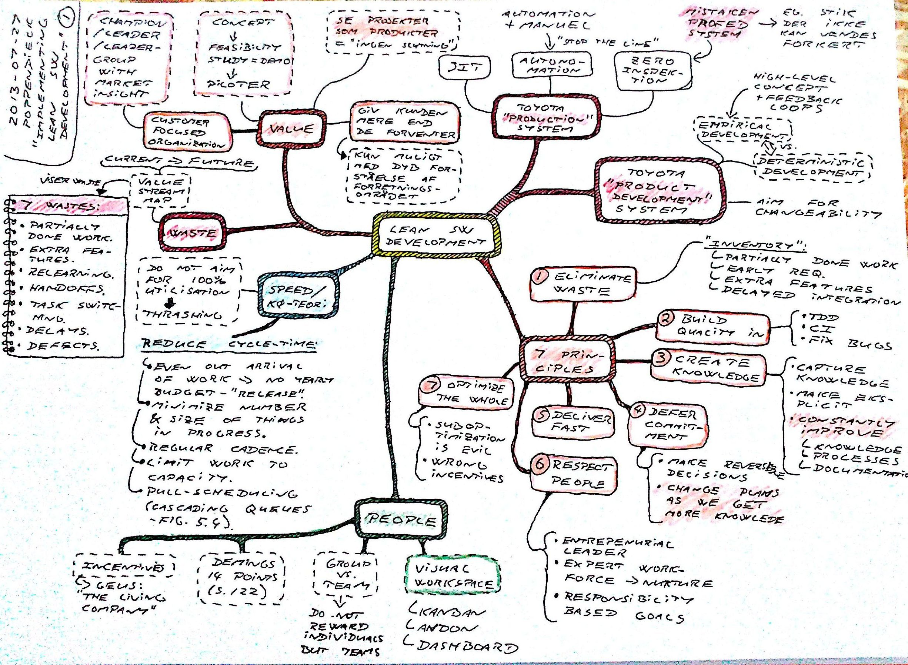
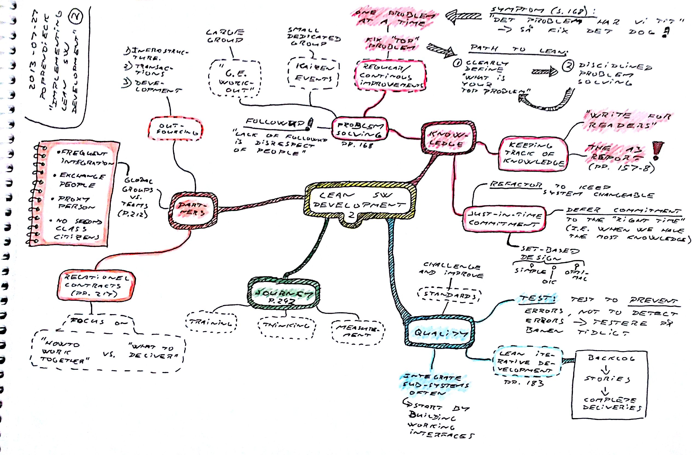

### Implementing Lean Software Development

**Mary & Tom Poppendieck** [*Implementing Lean Software Development*](https://www.amazon.co.uk/Implementing-Lean-Software-Development-Addison-Wesley-ebook/dp/B00HNB3VQE)

*Lean software development* is inspired from the Toyota *production* and *product development* systems.

Look at *projects* as *products*. There is no end-date.

Give the customers more than they expect, which is only possible with a deep understanding of the business.

#### The 7 principles

1. Eliminate waste
2. Build quality in - TDD, CI, fix bugs
3. Create and capture knowledge
4. Defer commitment - change plans as we get more knowledge
5. Deliver fast
6. Respect people
7. Optimize the whole

#### Waste

Minimize the 7 types of waste in a software project.

#### Knowledge

Keeping track of knowledge through the *A3* report (e.g. mindmap and collection of notes on one piece of A3)

#### Dealing with partners

* frequent integration
* exchange people
* use proxy persons
* no second class citizens

*Relational contracts* - focus on *howto work together* vs. *what to deliver*

