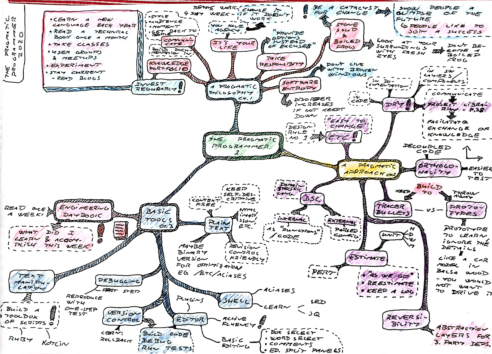
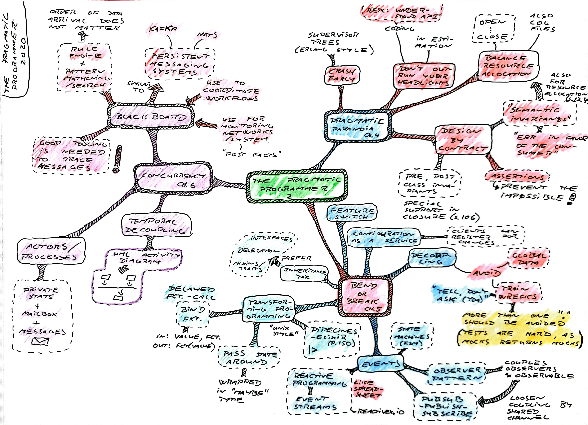
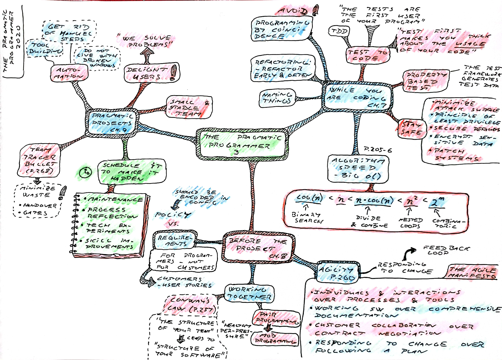

### The Pragmatic Programmer

**David Thomas & Andrew Hunt** [*The Pragmatic Programmer, 20th Anniversary Edition*](https://pragprog.com/titles/tpp20/the-pragmatic-programmer-20th-anniversary-edition/)

1. A Pragmatic *Philosophy*
2. A Pragmatic *Approach*
3. Basic Tools
4. Pragmatic *Paranoia*
5. Bend or Break
6. Concurrency
7. While You are Coding
8. Before the Project
9. Pragmatic *Projects*

