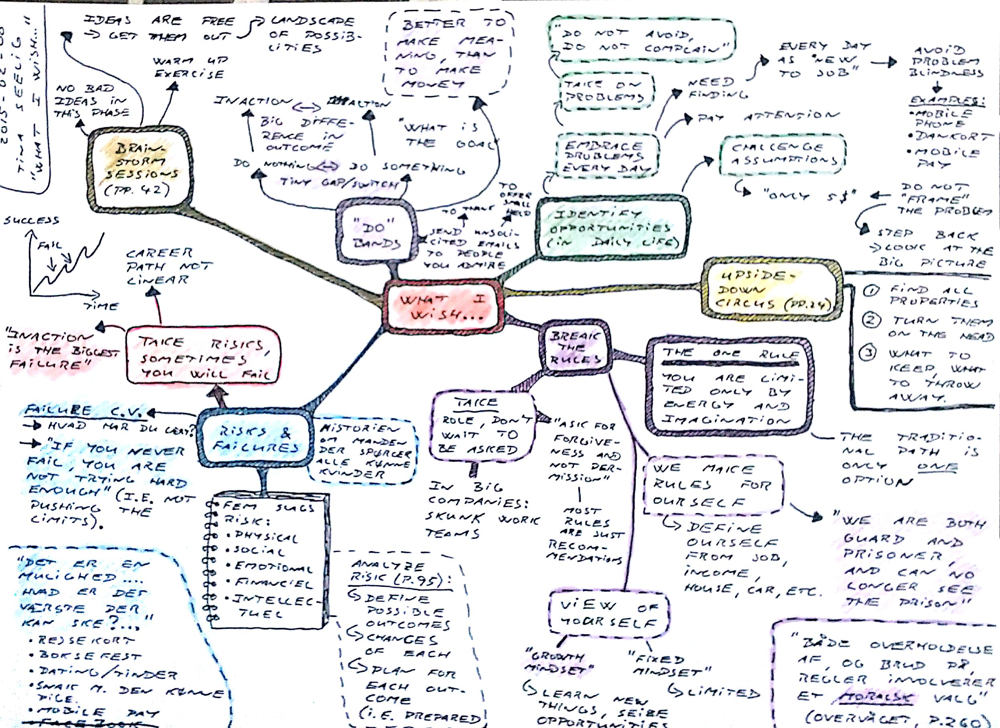
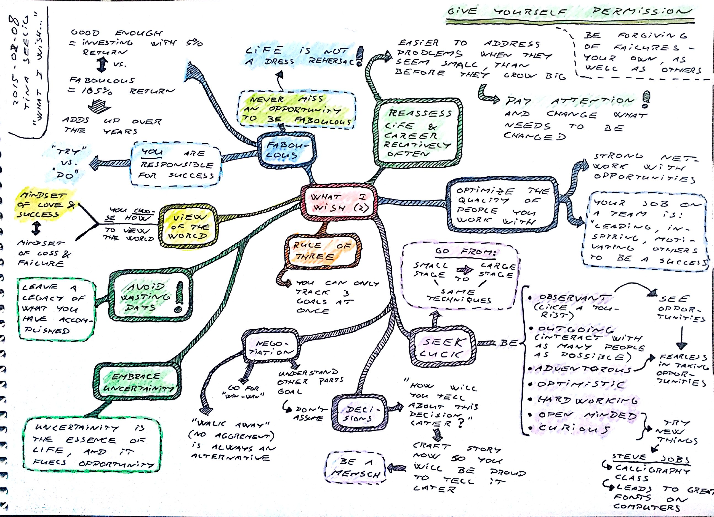

## What I Wish I Knew When I Was 20

**Tina Seelig** [*What I Wish I Knew When I Was 20*](https://www.amazon.co.uk/What-Wish-Knew-When-Was-ebook/dp/B07Q83G41J/)

**Better to make meaning, than to make money**

*Break the rules*

* **take** role, don't wait to be asked.
* most rules are just recommandations.
* ask for forgiveness, not permission.

The *rule of three*: You can only track 3 goals at a gime. Avoid shiny new directions.

About *risks & failures*

* Take risks, sometimes you will fail.
* Inaction is the biggest failure.
* failure CV

**Be a Mensch**: *How will you tell about this decision later*

