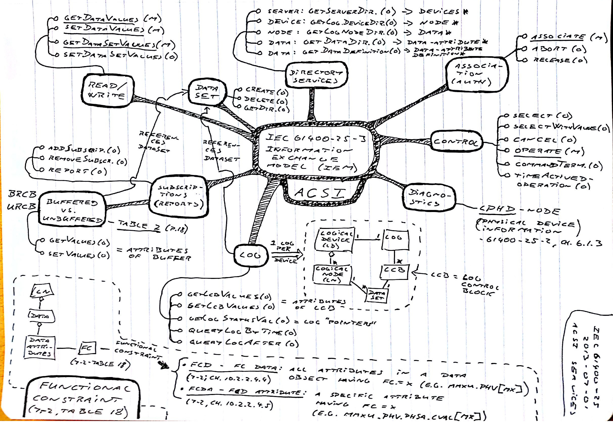

### Notes on IEC61400-25, IEC61850 and IEC60870-5

#### [IEC61400-25](https://en.wikipedia.org/wiki/IEC_61400-25)

IEC61400-25 is a standard describing *communication* between SCADA systems and wind power plants/turbines. It also fully describes the *data-objects* a wind power plant/turbine MUST (the mandatory data) and MAY (the optional data) expose.

In large parts IEC61400-25 extends or builds upon the *Information Model (IM)* and *Information Exchange Model (IEM)* standardized in IEC61850-7.

To get a relatively complete overview of the main idea of the standard and the content of the main parts, chapter 5-8 in 25-1 should be read (approximately 20 pages).

##### IEC61400-25 Parts

* **25-2 Information Model (IM)** describes a full object model that wind power plants/turbines must expose to comply with IEC61400-25.
  * on the mindmap the classes in the object model is seen in the mid-bottom:
    * A server contains a number of *logical devices*, each consisting of a number of *logical nodes*, each containing a number of *data values and attributes*.
  * Annex D from 25-2 lists the logical nodes that are mandatory.
  * It should be noted that the IM in IEC61400-25-2 is not a completely self-contained model. Quite a few of the logical nodes and datatypes are just references to content described in IEC61850-7.
* **25-3 Information Exchange Model (IEM)** describes an *abstract* communication model. On the mindmap it is seen how this defines a number of operations, listed in the box on the left: *ACSI - Abstract Communication Service Interface* and detailed below.

  * For IEC61400-25-3 it should also be noted that the IEM is not completely self-contained. Quite a few details of the services are references to content described in IEC61850-7.
* **25-4 IEM Mapping to Communication Profile** describes 5 different actual implementations of the IEM.
  * Mapping A is a full *webservice (WS)* implementation of the IEM.
  * Mapping B is a partly implementation using *OPC-XML-DA*.
  * Mapping C is a fully compliant implementation  using *MMS* (a communication and encoding standard described in ISO9506 and IEC61850-8).
  * Mapping D is a partly implementation using *IEC60870-5-104* (see further description below). One of the missing features in this mapping is that there is no support for the discovery services, meaning that the client must get a full configuration "out-of-band".
  * Mapping E is a fully compliant implementation using DNP3 standardized in IEEE1815.

#### [IEC61850](https://en.wikipedia.org/wiki/IEC_61850)

* [IEC 61850](https://iec61850.dvl.iec.ch/)
* [News on IEC 61850](http://blog.nettedautomation.com/) blog on "IEC 61850 and related Standards" (IEC 61850, IEC 61400-25, IEC 61970 (CIM), IEC 60870-5, DNP3, IEC 62351) by one of the authors of the standards.

Is a set of standards related to the *design and communication with automation of electrical substations*.

The idea of an *Information Model (IM)* and an *Information Exchange Model (IEM)* with a set of *abstract ACSI services* is something IEC61400-25 borrows from this IEC61850-7 standard.

#### [IEC60870-5](https://en.wikipedia.org/wiki/IEC_60870-5)

Is an old set of standards for *telecontrol systems in power system automation*.

Mostly relevant is the newer 10x parts:

* **5-101 Transmission Protocol** defines the full communication stack for seriel(?) communication with 3 layers:
  * application: On this layer a set of basic tasks/functions are defined. Examples of the types of functions are given in the box on the right of the mindmap.
  * link: On this layer the low level packets (ASDU), encoding (BER) and addressing (IOA) are defined.
  * physical.
* **5-104 Transmission Protocol using TCP/IP**. Is is assumed that this basically describes how the link layer ASCU packets are encoded as TCP/IP packages.
