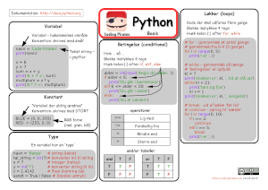

### Coding Pirates

I 2014-2015 underviste jeg som frivillig i [Coding Pirates](https://codingpirates.dk/) på ITU.

I den forbindelse lavede jeg et par cheatsheets til børnene:

Jeg tog udgangspunkt i **Jason R. Briggs** [*Python for Kids*](http://jasonrbriggs.com/python-for-kids/) samt en masse online pygame resourcer.

Et par af de programmer vi underviste børnene udfra vha. [Pygame](https://www.pygame.org/):

* [step1_loop.py](./step1_loop.py) - et simpelt loop der renderer en rød bold.
* [step2_random.py](./step2_random.py) - tilfældig tegning af bolde i tilfældige farver.
* [step3_bouncingball.py](./step3_bouncingball.py) - en hoppende bold - dvs. kollisions check med kanterne.
* [step3_bouncingball_dual.py](./step3_bouncingball_dual.py) - udbydning med to hoppende bolde. Så nu også kollisions check med hinanden.
* [step4_events.py](./step4_events.py) - håndtering af muse klik.
* [step5_shootgame.py](./step5_shootgame.py) - et simpelt skud spil.
* [step6_batgame.py](./step6_batgame.py) - et simpelt pong spil.

I forbindelse med afslutningerne inden ferierne lavede vi et lidt større spil med grafik og lyd over flere uger.

#### Tank spil

Et tank skyde spil

#### Jule spil

Et jule afslutnings spil - der er en screen capture af det her [xmas.ogv](./xmas/xmas.ogv).

 -
