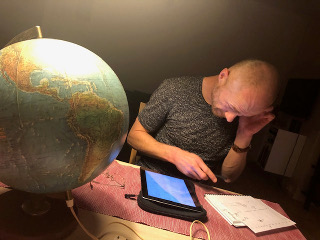
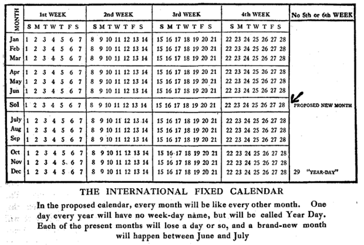

### Corona frikvarter

Et par små nørdede foredrag jeg holdt for en 7-klasses elev i corona tiden i foråret 2020 da vi alle var hjemsendt fra skole og arbejde.

#### Globus tidsbestemmelse [-> præsentation](./globus/globus.pdf)

En lille gennemgang af en gammel globus uden årstal for at tidsbestemme den. Det gav lidt viden om spændende fortidige lande som Østpakistan, Dahomey, kolonien Ifni og verdens næstmindste selvstændige stat Nauru.

#### Tidsmåling og kalender historie [-> præsentation](./kalender/kalender.pdf)

Alskens spændende historiske oplysninger om hvorfor vores kalendre er som de er. Om solsystemet som et gigantisk urværk. Om hvorfor der i Sverige var en 30.februar 1712. Om solar kalendre, lunar kalendre og lunisolar kalendre, om 13 måneders kalenderen og om den franske revolutions kalender hvor alt skulle kunne deles med 10.

Det var inspireret af [Hjernekassen på P1 om skudår](https://www.dr.dk/radio/p1/hjernekassen-pa-p1/hjernekassen-pa-p1-2016-02-29)

En anden spændende kalender gennemgang på engelsk [UTC is enough for everyone ...right?](https://zachholman.com/talk/utc-is-enough-for-everyone-right). Indeholder blandt andet historien om hvordan Samoa i 2011 sprang en dag over da man flyttede over på den anden side af dato linien. Der er også historien om hvad UTC er en forkortelse for - faktisk ingenting, men et kompromis mellem engelsk og fransk. Der er også historien om hvordan Rusland kom for sent til OL i 1908, da man kørte efter den Julianske kalender indtil 1918 (som et af de sidste lande i Europa)

Denne her side indeholder også en masse sjove kalender fakta [Your Calendrical Fallacy Is...](https://yourcalendricalfallacyis.com/)
