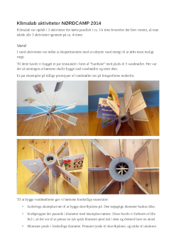

### Klimalab aktiviteter NØRDCAMP 2014

Opsummering af de 3 naturvidenskabs aktiviteter jeg var med til at arrangere og lave til Nørdcamp sommercamps i sommerferien 2014.

**Klimalab aktiviteter NØRDCAMP 2014**

Beskrivelser af test stande og aktiviterne.

* [lille film med en af vores vindmøller i drift](./vindmølle.mp4)

For at motivere og inspirere børnene skulle de igennem tre klima relaterede aktiviter

* **vind** - aktivitet med det formål at eksperimentere med vindmølle vinger til at producere strøm.
* **vand** - aktivitet med det formål at udnytte vand energi til at løfte mest muligt vægt
* **"strøm"** - aktivet med lodning og lidt basal el.
